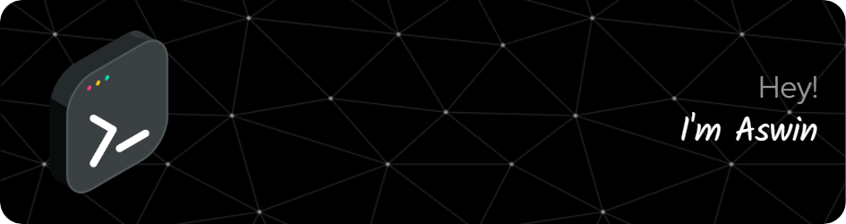

<!-- Gradient horizontal divider -->


<!---->
<!--  -->
<h1 align="center"><b>Hi, I'm Aswin</b> </h1>

<!-- Introduction section with text animation -->
<p align="center">
    
</p>


<!-- About Me -->
<div id="user-content-toc">
  <ul align="center">
    <summary><h2 style="display: inline-block">About Me </h2></summary>
  </ul>
</div>

```js
import SoftwareDeveloper from 'aswin';

class Bio extends SoftwareDeveloper {
  name     = 'Aswin V K';
  title    = 'Aspiring Frontend React Developer';
  company  = 'Bannari Amman Institute of Technology';
  location = 'Tamil Nadu, India';
}

class Skills extends SoftwareDeveloper {
  languages  = ['JavaScript', 'C', 'C++', 'Python', 'HTML', 'CSS'];
  databases  = ['MariaDB', 'MySQL'];
  frameworks = ['React', 'Flutter', 'Node.js', 'Express'];
}

```
<!-- GitHub Stats and Trophy section -->
<div id="user-content-toc">
  <ul align="center">
    <summary><h2 style="display: inline-block">GitHub Stats 📈</h2></summary>
  </ul>
</div>
<p align="center">
  <!-- GitHub Stats -->
  <table align="center">
    <tr border="none">
      <td width="50%" align="center">
        
        <br />
         
      </td>
      <td width="50%" align="center">
        
      </td>
    </tr>
  </table>

  <!-- GitHub Trophy -->
  <div align="center">
      
  </div>
</p>

<!-- Technologies I Know section -->
<div id="user-content-toc">
  <ul align="center">
    <summary><h2 style="display: inline-block">Tech Stack 👨🏻‍💻</h2></summary>
  </ul>
</div>
<!-- Tech stack icons -->
<p align="center">
  
</p>

<!-- Connect With Me section -->
<div id="user-content-toc">
  <ul align="center">
    <summary><h2 style="display: inline-block">Connect With Me 🤝</h2></summary>
  </ul>
</div>
<!-- Icons and links -->
<p align="center">
  <p align="center">
  <a href="https://www.linkedin.com/in/vkaswin" target="blank"></a>
  <a href="https://www.instagram.com/aswxn._03" target="blank"></a>
  <a href="mailto:vkaswinkanan@gmail.com" target="blank"></a>
</p>

</p>


<!-- Gradient horizontal divider at the bottom -->


<!-- Snake animation -->
<picture>
  <source
    media="(prefers-color-scheme: dark)"
    srcset="https://raw.githubusercontent.com/platane/snk/output/github-contribution-grid-snake-dark.svg"
  />
  <source
    media="(prefers-color-scheme: light)"
    srcset="https://raw.githubusercontent.com/platane/snk/output/github-contribution-grid-snake.svg"
  />
  
</picture>

<br>
<br>
<div align="center">
  
</div>

